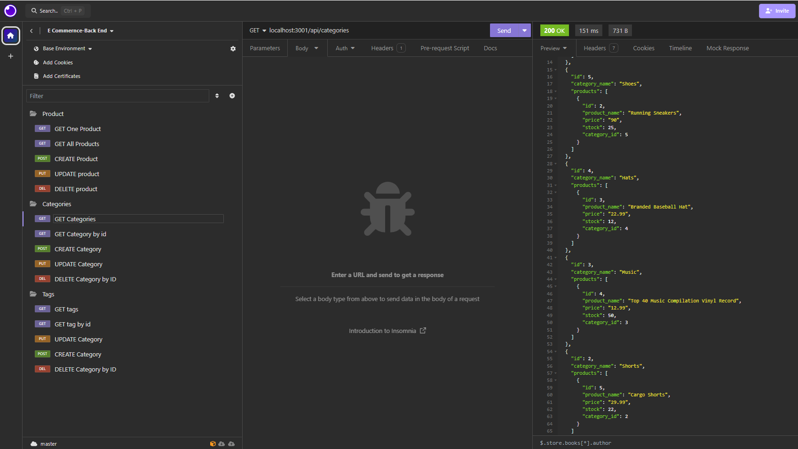

# E-commerce-Back-End



## Description
Welcome to the E-Commerce back end! This will feature how you can access a database on the back end based in the server section. In this application, you will see a database that will contain information of what items you would want to sell if you owned a store. You are featured with an env file that has the information you need to access the database and begin looking in the database assigned to you in this application. You can gather up data from the SQL database and then connect to it using Sequelize. You will be able to seed data to help test out the products in the server as well as Insomnia to make sure everything you need is featured within the database. I also learned how to create models for categories, products and the tags of each item listed within the database, and to give them specific defining for each sub category of each model. You will be able to use some APIs within the routes of the server side to help with tracking each item and it also gives you the chance to have control of which items you need and do not need based on the choice of the user. This application will also provide you with seeds that you can use to ins and to get a chance with a program called Insomnia to view all the items, one item at a time, create new items, update items, and delete items. The Link section will take you to a video to show how it all works with the database and Insomnia. Have fun with the E-Commerce back end!

## Link
https://drive.google.com/file/d/1V1aogL94LCU26e_NafLMIxRkQkLzftnV/view

## Table of Contents
 * [Description](#description)
 * [Installation](#installation)
 * [Usage](#usage)
 * [License](#license)
 * [Contributing](#contributing)
 * [Tests](#tests)
 * [Questions](#questions)
 * [Resources](#resources)

## Installation
You will need these npm (Node Package Manager) along with the uuid in order to use the E-Commerce back end with these commands:
```
npm install
npm install dotenv
npm install pg
npm install sequelize
```
## Usage
You can use the "Node.js" terminal to check out the E-Commerce back end for information in the database.

## License
This project is licensed with MIT

## Contributing
All the contributions to this project is all done by Miles Wildmore


## Tests

When you enter the terminal, you will need to open up SQL to bring in the database to the main terminal. Use the following command along with your username before you type in your password:
```
psql -U 

```
After you type in the password, be sure to type the following command to get rid of an existing database and create a new one to avoid mixing different databases:
```
\i schema.sql
```
Then type in this command to leave the database:
```
\q
```

To test out the E-Commerce back end, to test the data and to see all the information featured in the database, navigate to the server js file, and use the follow commands in the terminal:
```
npm run seed
node server.js

```

If you want to leave the E-Commerce back end, hold "CTRL+C" ("CMD+C" for Mac) to stop hosting localhost 3001.

## Resources

Link to npm page : https://www.npmjs.com/

Link to get node.js: https://nodejs.org/

## Questions
If you would like contact me for further information, be sure to reach out to me at mileswildmore@hotmail.com

If you would like to know how to setup dependencies, check out my repo at https://github.com/mileswildmore18